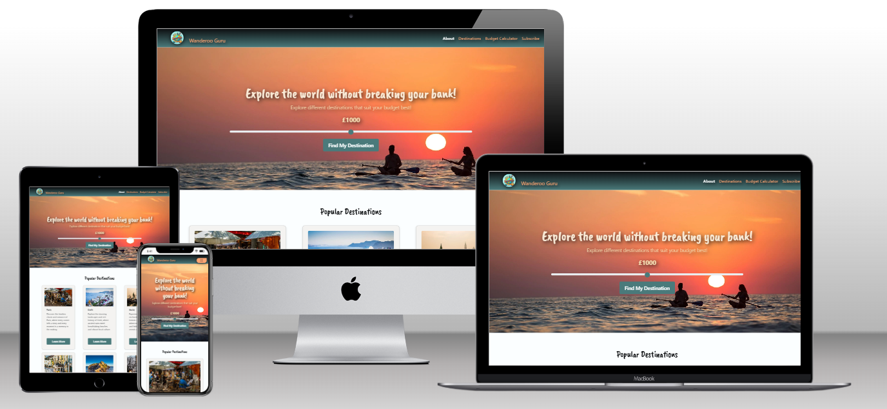
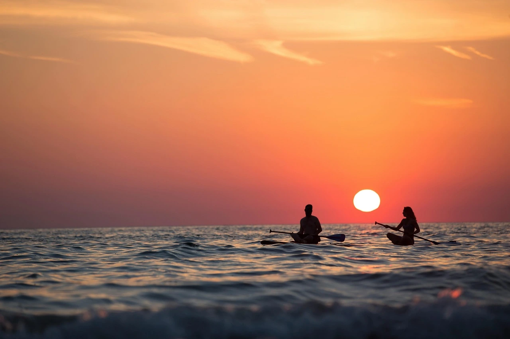

# Wandaroo Guru

Do you want to see the world? Do you have a budget? Do you know you can have both of these at the same time? Wandaroo Guru is here to help you explore the world without breaking your bank! Explore different destinations across the world with an additional perspective: Your Budget! This website is here to help anyone looking for budget conscious travel suggestions with their estimated costs and photos from the lens of other travelers who visited them!

# Contents

1. [UX Design](#ux-design)
    - [Wireframe Design](#wireframe-design)
    - [Hero Image](#hero-image)
    - [Colours](#colours)
    - [Fonts](#fonts)
2. [User Stories](#user-stories)
3. [Features](#features)
4. [A.I. Integration](#ai-integration)
5. [Testing](#testing)
6. [Bugs](#bugs)
7. [Deployment](#deployment)
8. [Credits/Technologies Used](#credits)
9. [Future Features](#future-features)

## UX Design

### Wireframe Design

## Hero Image
A captivating hero image was chosen to immediately grab the user's attention and spark their interest in the platform. This visually appealing image sets the tone for the entire user experience, creating an inviting and engaging atmosphere. The hero image is carefully selected to be appropriate for the target audience, reflecting the adventurous and budget-friendly spirit of the platform. The colors within the image are harmonized with the overall color scheme of the website, ensuring a cohesive and aesthetically pleasing design that enhances readability and user engagement.

## Colours
The color scheme is inspired by the vibrant and captivating hero image that greets users upon landing on the site. The primary colors were carefully selected to reflect the adventurous and budget-friendly spirit of the platform. These colors were then fine-tuned to create a balanced palette that is both visually appealing and functional, ensuring readability and a pleasant user experience whilst maintaining a professional and trustworthy appearance.

## Fonts

### Kanit font
A visually striking font that captures attention and enhances the overall aesthetic of the design.

### Gloria Hallelujah
A playful and handwritten font that complements the adventurous and budget-friendly vibe of the platform.

### Lexend font

Easy read fonts that have been developed to  reduce reading fatigue and make reading more accessible for those with reading difficulties.

## User Stories

## Features

- **Navigation**

The navigation section of the page was designed to allow the user to navigate through the different sections of the page with flexibility. Also, the logo and name of the company were added to differentiate the website from other websites offering similar services 

- **Hero Image**

The hero image was chosen to reflect the overall theme of the website. To allow users achieve their goal of seeing destinations based on a budget they input, a slider was designed that triggers dynamically generated cards based on the inputted price range 

- **Call to Action Button**

The main call to action button for this website is the find my destination button which allows users see what destinations are within their budget 

- **Budget Slider**

- **Destinations based on budget**

Destinations based on the users budget are generated as cards and focus on describing the budget users should be aware of if they visit the recommended destination. 

- **Default Destinations**

When users visit the page they are presented with default destinations that might interest them. This was designed for users who want to find their next travel destination but they are not constricted to price ranges. These cards also include a learn more button which allows interested users to book the destination 

- **Budget Calculator**

Budget calculator is an essential tool that was designed to allow users generate an estimate of the total budget they have. It focuses on calculating the total budget for their travel by factoring in the price per night they aim to spend on food, transport and activities, taking into consideration the number of guests 

- **Interactive Map**

- **Footer**

The footer was designed to showcase the tram behind the website 

## A.I. Integration

Copilot was employed to generate strategic planning ideas for the team. These AI-generated suggestions were subsequently refined to align with the specific project requirements.

**Idea Generation**

- Identifing popular holiday destinations from the UK, which served as the foundational dataset for our resort catalog.

- Generate logo designs based on specified instructions.

**Development Support**

-

-

## Testing

### Manual Testing

### Lighthouse

### Responsive Testing

### Validator Testing

- HTML

- CSS

- Javascript

## Bugs

### Bug 1

Fix

- Removed links to the manifest as not required at present but maybe for future development of a Progressive Web App (PWA)

### Bug 2
 - Hero image not displaying.

Fix

After exploring potential errors in the code such as unclosed blocks and wrongly addressed links, it was recognised that the error was due to a misaligniment of variables set in the root of the css file. Aligning these variables in the css file resulted in fixing the issue.

## Deployment

During this project, Git was an essential tracking tool used to monitor the progress of the website towards final deployments. Git commits were used to allow version tracking and restoring previous states if needed amongst Git push, Git pull, Git add. These commits were stored and Github was used to store the project and deploy the site.

GitHub was used to deploy the website. These were the steps taken to acheive this:  

1. Login to GitHub account
2. Navigate to the project repository, mental_health_deserves_awareness
3. Click the Settings button near the top of the page
4. In the left-hand menu, find and click on the Pages button
5. In the Source section, choose 'main' from the drop-down, select branch menu
6. Select 'root' from the drop-down folder menu
7. Click 'Save' and after a few moments the project will have been made live and a link is visible at the top of the page
   
## Credits

### Content

### Technologies

- [Leaflet](https://leafletjs.com/reference.html) - Open source street map, data available under the Open Database License.

### Media

- Images to webp [FreeConvert](https://www.freeconvert.com)

- Hero image [pexels](https://images.pexels.com/photos/165505/pexels-photo-165505.jpeg)

- Holiday location images [Pixabay](https://pixabay.com)

- Favicon converter [Favicon.io](https://favicon.io)

- Copilot used for logo generating of favicon and Script Shifters emblem

## Future Features

